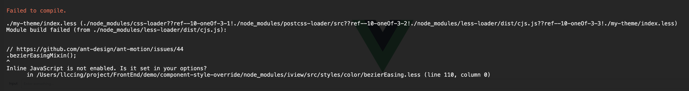

# 组件的重写

    现在开发后台管理系统，你不用个组件库都不好意思跟人打招呼。

做了很多后台管理系统，并且一直和UI、测试同学，针对组件库的事甩锅给组件的开发者。

**甩**

UI：“这个按钮太大了，改小一点。”

怼回去；“这个是组件内部写死的，不好改。”

**再甩**

测试：“这有个bug！”

怼回去：“这个组件有bug，等他升级了，我们更新下依赖就行。”

 事情的进展
虽然通过上面的沟通可以暂时将问题压下去，但是这毕竟不是一个好的解决问题的方式。所以还是需要去解决。
针对样式问题，组件库的官方其实会给出一个解决解决方案。

## iview组件库的样式覆盖

环境：**vue@2.6.6 iview@3.2.2**


error


解决
[https://stackoverflow.com/questions/46729091/enable-inline-javascript-in-less](https://stackoverflow.com/questions/46729091/enable-inline-javascript-in-less)
[https://cli.vuejs.org/zh/config/#css-loaderoptions](https://cli.vuejs.org/zh/config/#css-loaderoptions)

使用vue.config.js修改lessloader的配置，才可以顺利覆盖less文件。
```
module.exports = {
  css: {
    loaderOptions: {
      less: {
        // 这里的选项会传递给 less-loader
        javascriptEnabled: true
      }
    }
  }
}

```
我们只要修改less变量的值，就能够达到修改样式的目的，如下是部分变量，[全部变量在这里](https://github.com/iview/iview/blob/master/src/styles/custom.less)
```less
// Prefix
@css-prefix             : ivu-;
@css-prefix-iconfont    : ivu-icon;

// Color
@primary-color          : #2d8cf0;

...
```
完整代码在下方

## element-ui组件库的样式覆盖
创建vue项目时记得选择scss就可以

做如下修改
```SCSS
/* 改变主题色变量 */
$--color-primary: teal;

$--button-font-size: 16px !default;

$--border-radius-base: 0px !default;
$--border-radius-small: 0px !default;

/* 改变 icon 字体路径变量，必需 */
$--font-path: '~element-ui/lib/theme-chalk/fonts';

@import "~element-ui/packages/theme-chalk/src/index";
```

覆盖变量可以参考 [element 项目中定义的变量](https://github.com/ElemeFE/element/blob/master/packages/theme-chalk/src/common/var.scss)
```SCSS
/* Element Chalk Variables */
/* Colors
-------------------------- */
$--color-white: #fff !default;
$--color-black: #000 !default;

$--color-primary: #409EFF !default;
...
```

从修改上来看还是element-ui是个正经的组件库。

## iview的组件逻辑调整

这个idea不是我，来自华为云的开发！感谢！

show you code!
```js
<template>
  // template将iview源码的中的Table.vue的template复制过来就可以。
  // 当然如果你想自定义那么也可以做更改
</template>
<script>
import {Table} from 'iview'
export default {
  mixins:[Table],
    mounted () {
        console.log('do what you want to do in mounted!')
    },
}
</script>
```
完整代码在下方

## element-ui的组件逻辑调整

修改的方式和iview的组件类似，不过element-ui中，el-table-column暂时没有做修改。


## 源码
1. [component-style-override-element](https://github.com/llccing/FrontEnd/tree/master/demo/component-style-override-element)
2. [component-style-override-iview](https://github.com/llccing/FrontEnd/tree/master/demo/component-style-override-iview)
